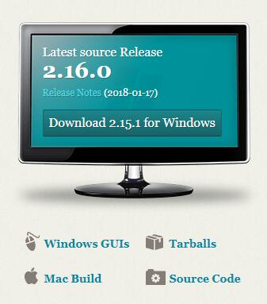
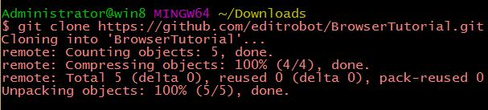

# How To Use Git #

第一步： 安装 git 客户端

> 打开这个链接:  [https://git-scm.com/](https://git-scm.com/ "https://git-scm.com/")
> 
> 下载安装包。

如图所示：

----------

第二步： 用git下载本项目到你的电脑上

    git clone https://github.com/editrobot/BrowserTutorial.git

如图所示：

